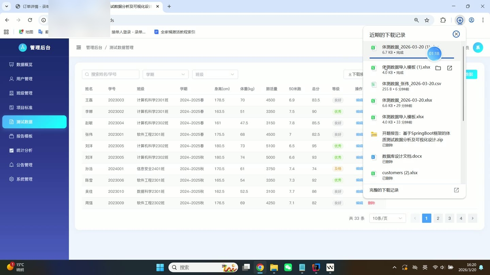
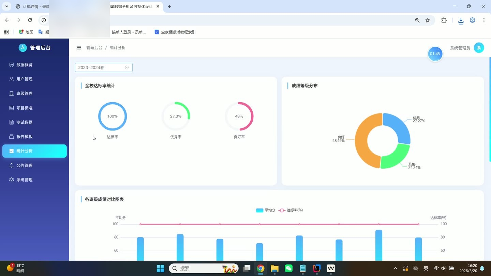
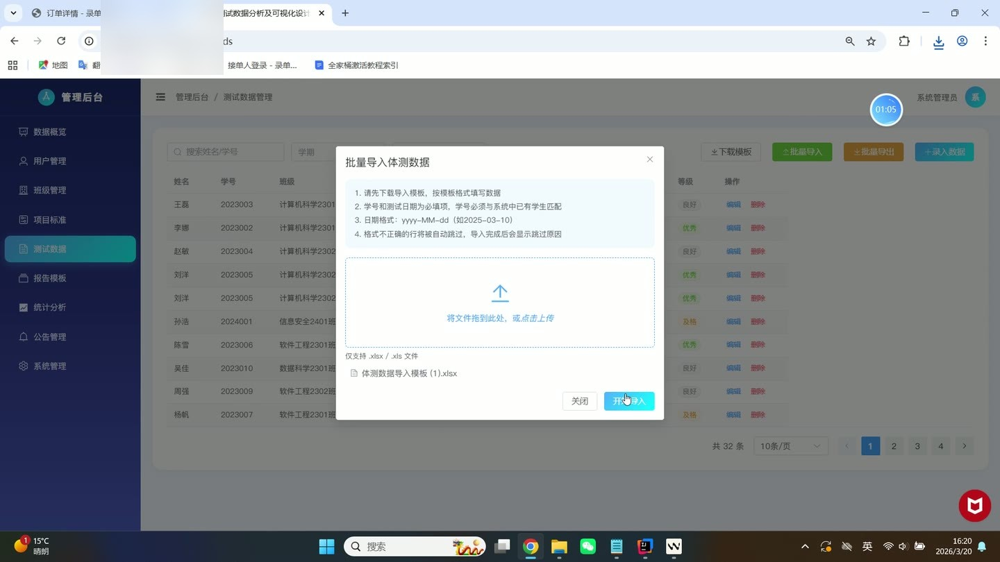
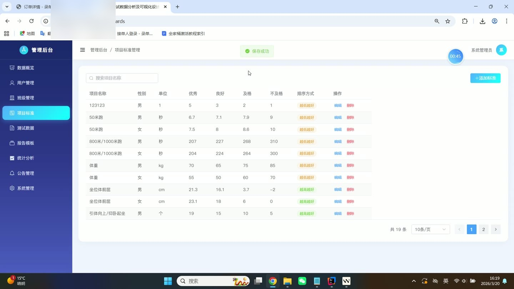
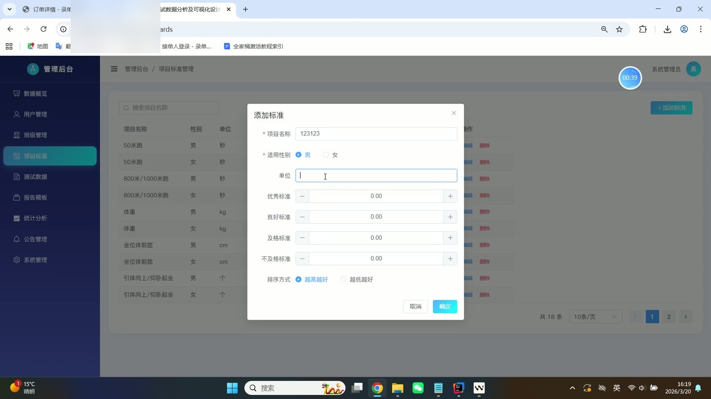

# (附文档)Springboot3+Vue3+MySQL 体质测试数据分析及可视化设计

**技术栈**：Springboot3、Vue3、MySQL

### 系统简介

本系统是一套基于 Spring Boot 3 + Vue 3 + MySQL 的体质测试数据分析与可视化平台，采用前后端分离架构。系统包含管理员与学生两大角色，提供体测数据录入、多维度统计分析、可视化图表展示、班级排名、报告模板管理、公告发布、反馈提交等完整功能，帮助学校或机构高效管理学生体质健康数据。
 
### 核心功能
 
### 管理员端

 
- 查看系统数据概览仪表盘，展示体测总人数、及格率、优秀率、平均分等核心指标 
- 管理学生用户：分页查询学生列表（支持按姓名/学号关键词搜索、按班级筛选），新增学生账号（自动检测用户名唯一性），编辑学生信息，重置密码（默认密码 123456），删除学生账号 
- 管理班级：分页查询班级列表（支持按班级名称/年级关键词搜索），新增班级，编辑班级信息，删除班级（班级下存在学生时禁止删除），查看班级学生人数 
- 为学生分配班级：通过 userId 和 classId 将学生归属到指定班级 
- 管理体测项目标准：分页查询标准列表（支持按项目名称搜索），按性别筛选标准，新增/编辑/删除标准（包含性别、项目名称、单位、优秀/良好/及格/不及格分数线、是否数值越大越好） 
- 管理体测记录：分页查询记录（支持按学期、班级、姓名/学号关键词筛选），新增/编辑/批量新增记录，删除记录 
- 导入体测记录：上传 Excel 文件，自动解析并校验学号是否存在、日期格式是否正确，自动计算 BMI，返回成功条数与错误详情 
- 导出体测记录：按筛选条件导出为 Excel 文件，包含学号、姓名、测试日期、学期、身高、体重、BMI、肺活量、50米跑、坐位体前屈、立定跳远、引体向上、800/1000米跑、跳绳、总分、等级等字段 
- 下载导入模板：提供标准 Excel 模板文件，包含示例数据与字段说明 
- 查看统计分析：展示总体统计（总记录数、及格率、优秀率、平均分、等级分布），班级对比统计（各班级平均分、及格率对比），班级内排名（按总分或单项指标排序，支持按学期筛选） 
- 管理报告模板：分页查询模板列表，新增/编辑/删除模板，上传模板文件（支持 Word/PDF 等格式） 
- 管理公告：分页查询公告列表，新增/编辑/删除公告（包含标题、内容、发布人、封面图、状态），公告自动记录发布人姓名 
- 系统管理：查看系统设置页面（预留扩展）
 
### 普通用户端（学生端）

 
- 查看个人仪表盘：展示个人最近体测数据概览、总分与等级 
- 查看个人信息：显示学号、姓名、性别、年龄、班级、电话、头像等基本信息 
- 查看个人体测记录：按时间顺序列出所有历史体测数据，包含身高、体重、BMI、肺活量、50米跑、坐位体前屈、立定跳远、引体向上、800/1000米跑、跳绳、总分、等级 
- 查看分析报告：基于个人体测数据生成详细分析报告（页面预留展示区域） 
- 查看趋势图表：以折线图形式展示个人各项体测指标随时间的变化趋势 
- 查看雷达图表：以雷达图形式综合展示个人各项体测能力（力量、速度、耐力、柔韧等） 
- 查看标准对照：根据性别查看各体测项目的评分标准，对比个人成绩 
- 查看班级排名：查看本班级内按总分或单项指标（身高、体重、肺活量、50米跑等）的排名列表，支持按学期筛选 
- 查看个人建议：系统根据体测成绩给出针对性的运动或健康建议（页面预留展示区域） 
- 导出个人数据：将个人体测记录导出为 Excel 文件 
- 提交反馈：对特定体测记录提交反馈意见，支持标记已读状态 
- 查看公告：浏览管理员发布的所有已启用的公告列表，查看公告详情
 
### 技术栈

 后端框架Spring Boot 3.x ORMMyBatis-Plus 3.x 权限基于 Session 的登录鉴权（AuthController） 前端框架Vue 3（Composition API） 状态管理Vue Router（路由级状态） 构建工具Vite UI 组件库Element Plus 数据库MySQL 8.x 数据导出EasyExcel（Alibaba） 密码加密BCrypt（Hutool） 文件上传Spring MultipartFile
 
### 交付内容

 
- 后端完整源码 
- 前端完整源码 
- 数据库初始化脚本 
- 万字文档

## 界面展示

---

## 获取完整源码 + 万字文档

本仓库为项目介绍页。**完整前后端源码、数据库初始化脚本、万字项目文档**，请加微信 `kangkangcode`，或访问 [codekk.top](http://codekk.top) 获取。

可作课程设计 / 毕业设计参考，支持远程部署调试。